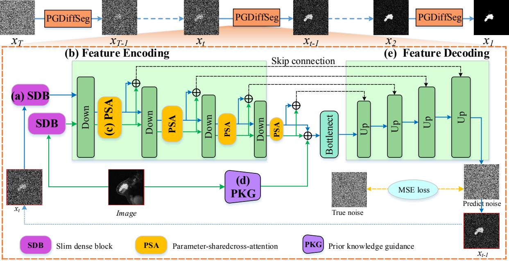

# PGDiffSeg: Prior-Guided Denoising Diffusion Model with Parameter-Shared Attention for Breast Cancer Segmentation


 

- data

- data_path
    - 0.npy
    - 1.npy
    - 2.npy
    ...
    train_list.txt
    val_list.txt
    test_list.txt

- train
``` sh
python main.py --name BUSI_train --data.root=/root/ffy/diffusion_image_segmentation/processed/BUSI/HU_30-235_3classes --data.train_list=train_list_aug --data.test_list=val_list --model.model_name=denoise_model --classify.classify_model=adapt_resnet2 --model.base_channels=64 --classify.load_resnet=pth_path --model.unet_rate 2 4 8 16 --diffusion.timesteps=300 --diffusion.beta_schedule=linear2 --training.epochs=500 --classify.classes=3 --training.sample_checkpoint=300 --model.super_resnet_deep=3 --optim.lr=1e-4
```

- test
``` sh
python main.py --name BUSI_train --data.root=/root/ffy/diffusion_image_segmentation/processed/BUSI/HU_30-235_3classes --data.train_list=train_list_aug --data.test_list=val_list --model.model_name=denoise_model --classify.classify_model=adapt_resnet2 --model.base_channels=64 --classify.load_resnet=pth_path --model.unet_rate 2 4 8 16 --diffusion.timesteps=300 --diffusion.beta_schedule=linear2  --classify.classes=3 --model.super_resnet_deep=3 --mode=test
```
